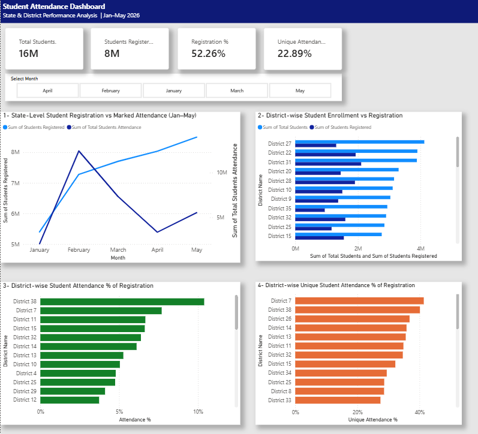

# Student Attendance Analytics Dashboard


## Dashboard Preview



## Project Overview

The **Student Attendance Analytics Dashboard** is an interactive Power BI project developed to analyze student enrolment, registration, and attendance performance at **state and district levels**.

The analysis covers **January to May 2026** and allows users to analyze overall performance as well as filter district-level results by month.

The project demonstrates practical skills in:

- Data preparation and consolidation
- Power Query
- Data modelling
- DAX calculations
- KPI development
- Interactive filtering
- Business metric interpretation
- Data visualization
- Dashboard design

---

## Business Requirements

The dashboard was developed to answer four key analytical requirements:

1. Analyze the **5-month state-level trend** of Students Registration vs Marked Attendance.
2. Compare **district-wise Student Enrolment vs Students Registration** for each month.
3. Analyze **district-wise Student Attendance as a percentage of Students Registration**.
4. Analyze **district-wise Unique Student Attendance as a percentage of Students Registration**.

---

## Dataset

The project uses monthly student attendance data from **January to May 2026**.

### Master Data Fields

The monthly datasets were consolidated into a master table containing:

| Field | Description |
|---|---|
| Month | Reporting month |
| S.No | Serial number |
| District Name | District identifier |
| Total Students | Total enrolled students |
| Students Registered | Students registered in the system |
| Students Registered In This Month | New registrations during the month |
| Daily Registration | Daily registration information |
| Unique Students Attendance | Students who attended at least once |
| Total Students Attendance | Total marked attendance records |
| Attendance Days | Number of attendance days used for calculation |

### Attendance Days

| Month | Attendance Days |
|---|---:|
| January | 25 |
| February | 23 |
| March | 25 |
| April | 24 |
| May | 25 |

---

## Data Preparation

The following preparation steps were performed before dashboard development:

- Combined January–May data into a single master dataset.
- Standardized column names and data types.
- Added the Month field for monthly analysis.
- Added Attendance Days for attendance-rate calculations.
- Created month-order logic for chronological visualization.
- Validated registration and attendance fields before creating measures.
- Loaded the prepared dataset into Power BI for analysis.

---

## DAX Measures

### Total Students KPI

The Total Students KPI avoids adding the same district enrolment repeatedly across monthly records.

```DAX
Total Students KPI =
SUMX(
    VALUES('Master Data All Months'[District Name]),
    CALCULATE(
        MAX('Master Data All Months'[Total Students])
    )
)
```

### Students Registered KPI

Used to display the registered student population in the current filter context.

```DAX
Students Registered KPI =
SUM('Master Data All Months'[Students Registered])
```

> If your actual KPI uses a different DAX measure, replace this formula with the exact measure used in the PBIX.

### Registration %

Registration percentage compares registered students with total students.

```DAX
Registration % =
DIVIDE(
    [Students Registered KPI],
    [Total Students KPI],
    0
)
```

### Attendance %

Attendance % measures attendance frequency across the available registered student-days.

```DAX
Attendance % =
DIVIDE(
    SUM('Master Data All Months'[Total Students Attendance]),
    SUMX(
        'Master Data All Months',
        'Master Data All Months'[Students Registered] *
        'Master Data All Months'[Attendance Days]
    ),
    0
)
```

### Unique Attendance %

Unique Attendance % measures the proportion of registered students who attended at least once.

```DAX
Unique Attendance % =
DIVIDE(
    SUM('Master Data All Months'[Unique Students Attendance]),
    SUM('Master Data All Months'[Students Registered]),
    0
)
```

### Month Sorting

A calculated column was created to maintain the correct chronological order.

```DAX
Month No =
SWITCH(
    'Master Data All Months'[Month],
    "January", 1,
    "February", 2,
    "March", 3,
    "April", 4,
    "May", 5
)
```

`Month` was then sorted using `Month No`.

---

## Understanding Attendance Metrics

### Attendance %

Attendance % represents the frequency of attendance across all available registered student-days.

**Formula:**

`Total Students Attendance / (Students Registered × Attendance Days)`

For example, if students are registered across multiple attendance days, the denominator represents the total possible student-attendance opportunities.

### Unique Attendance %

Unique Attendance % answers a different question:

> What percentage of registered students attended at least once?

**Formula:**

`Unique Students Attendance / Students Registered`

Because these metrics represent different concepts, **Attendance % and Unique Attendance % are not expected to have the same scale**.

---

## Dashboard KPIs

The dashboard contains four headline KPIs:

| KPI | Purpose |
|---|---|
| Total Students | Overall student enrolment |
| Students Registered | Registered student population |
| Registration % | Registration coverage |
| Unique Attendance % | Registered students attending at least once |

---

## Dashboard Visuals

### 1. State-Level Registration vs Marked Attendance

**Visual:** Line Chart

Displays the January–May trend for:

- Students Registered
- Total Students Attendance

This provides a state-level view of registration and marked-attendance movement over time.

### 2. District-wise Enrolment vs Registration

**Visual:** Clustered Bar Chart

Compares:

- Total Students
- Students Registered

This helps identify districts with stronger or weaker registration coverage relative to enrolment.

### 3. District-wise Student Attendance %

**Visual:** Horizontal Bar Chart

Ranks districts based on:

**Attendance % of Registration**

This helps compare attendance frequency across districts.

### 4. District-wise Unique Student Attendance %

**Visual:** Horizontal Bar Chart

Ranks districts based on:

**Unique Attendance % of Registration**

This identifies districts with stronger participation among registered students.

---

## Interactive Month Filter

A horizontal slicer provides filtering for:

`January | February | March | April | May`

Selecting a month updates the relevant district-level visuals.

When no individual month is selected, the dashboard provides the combined January–May view.

The state-level trend is designed to display the complete January–May trend.

---

## Dashboard Design

The dashboard follows a structured analytical layout:

**Header → KPI Cards → Month Slicer → 2 × 2 Analysis Grid**

The design uses:

- Light dashboard background
- White visual containers
- Navy header
- KPI summary cards
- Horizontal month slicer
- Clearly separated state and district analyses

---

## Key Insights Available

The dashboard enables users to quickly identify:

- Registration trends across five months
- Differences between enrolment and registration
- Districts with comparatively high or low attendance rates
- Districts with stronger unique student participation
- Monthly changes in district performance
- Overall registration coverage
- Attendance frequency versus student reach

---

## Tools & Technologies

| Tool | Usage |
|---|---|
| Power BI Desktop | Dashboard development |
| Power Query | Data preparation |
| DAX | Measures and calculated columns |
| Microsoft Excel | Source dataset |
| GitHub | Project documentation and version control |

---

## Repository Structure

```text
Student-Attendance-Dashboard/
│
├── Dashboard/
│   └── Student_Attendance_Dashboard_Jan_May_2026.pbix
│
├── Data/
│   └── Student_Attendance_Jan_May.xlsx
│
├── Screenshots/
│   └── Student_Attendance_Dashboard.png
│
└── README.md
```

---

## How to Run the Project

1. Clone or download this repository.
2. Install **Microsoft Power BI Desktop**.
3. Open the `.pbix` file available in the `Dashboard` folder.
4. Refresh the dataset if required.
5. Use the Month slicer to analyze individual months.
6. Clear the month selection to analyze the combined January–May results.

---

## Project Workflow

```text
Monthly Excel Data
        ↓
Data Consolidation
        ↓
Data Cleaning & Preparation
        ↓
Master Data Table
        ↓
Power BI Data Model
        ↓
DAX Measures & KPIs
        ↓
Interactive Visualizations
        ↓
Validation
        ↓
Final Dashboard
```

---

## Skills Demonstrated

**Power BI • DAX • Power Query • Excel • Data Cleaning • Data Modelling • KPI Development • Data Validation • Business Analysis • Data Visualization • Dashboard Development**

---

## Author

**Raj Pratap Singh**  
Data Analyst | Data Science Enthusiast
